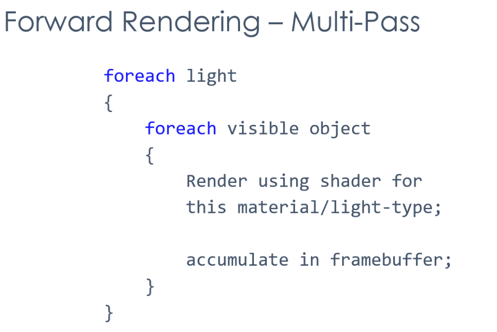
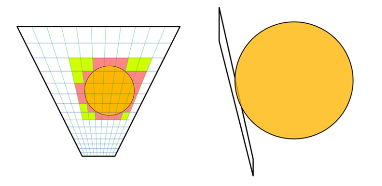
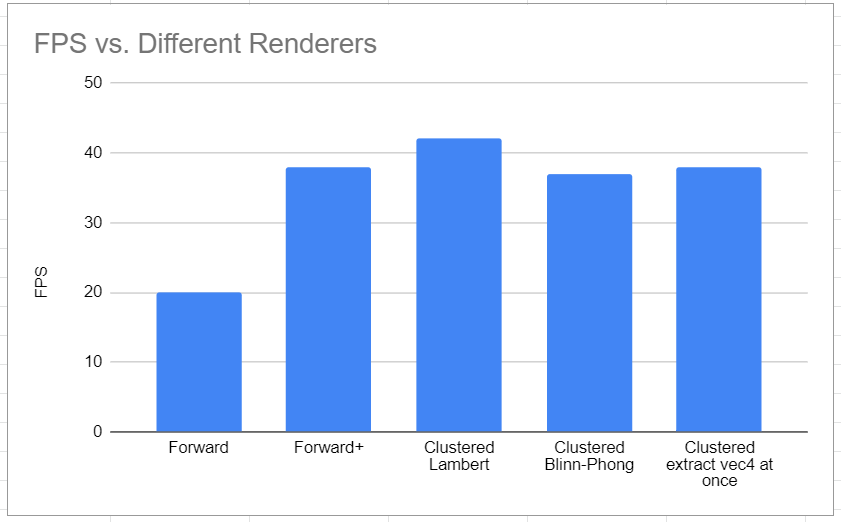
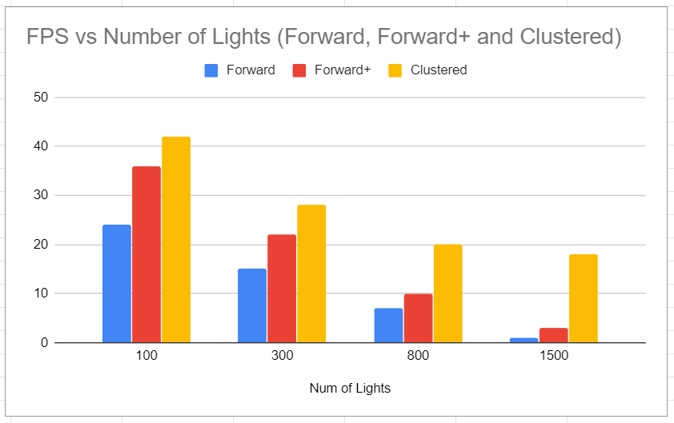

WebGL Clustered and Forward+ Shading
======================

**University of Pennsylvania, CIS 565: GPU Programming and Architecture, Project 5**

* Gangzheng Tong
  - www.gtong.me
* Tested on: **Google Chrome 78.0.3904.70** on
   Windows 10, i7-8750H @ 2.20GHz 16GB, RTX 2070 8GB (personal laptop)

### Live Online

https://gztong.github.io/Project6-WebGL-Clustered-Deferred-Forward-Plus/

### Demo Video/GIF

### Overview

This project demonstrates the forward, forward+ and clustered rendering in WebGL. 

The idea of forward+ and clustered rendering is that we assign each light a radius and bin these ligihts into clusters. When performing shading for the fragment, instead of looping over each lights like what we did for forward rendering, we only consider the lights within cluster of the fragment. So essentially we reduce the amount of lights significantly if the number of lights in the scene is large.

For clustered deferred shading, the G-buffer is introduced to reduce the computation. We firstly render the geometry data into g-buffers where we store the normal, albedo and position of vertices etc. In the second render pass, we can just use a quad for the vertex shader stage and sample the necessary data from the saved buffer. By doing this, we break the nested for loop into 2 loop and reduce the computation significantly for complex scene.

The Forward+ and clustered rendering technique both utilize the lights culling method. Instead of considering all lights, we only focus on the lights within a certain radius.  In the image below, we can see the light has influence only over the orange colored volume. So we count the light index in the affected clusters.  During the fragment shading, we only shade the fragment with the lights that saved in the cluster.

### Performance Analysis

Since my PC with a RTX 2070 cannot compare the FPS of the 3 renderers properly (they all capped at 144 FPS), the following FPS is measured with a MacBook with an integrated graphics card!

It's noticeable that clustered has the best performance among the 3 renderers, especially when the number of lights is large. This is expected because for deferred rendering we are essentially break the nested loop into a 2 parallel loops, thus reducing the time complexity from N^2 to N. So the effect is larger when N is large.

### Credits

* [Three.js](https://github.com/mrdoob/three.js) by [@mrdoob](https://github.com/mrdoob) and contributors
* [stats.js](https://github.com/mrdoob/stats.js) by [@mrdoob](https://github.com/mrdoob) and contributors
* [webgl-debug](https://github.com/KhronosGroup/WebGLDeveloperTools) by Khronos Group Inc.
* [glMatrix](https://github.com/toji/gl-matrix) by [@toji](https://github.com/toji) and contributors
* [minimal-gltf-loader](https://github.com/shrekshao/minimal-gltf-loader) by [@shrekshao](https://github.com/shrekshao)
